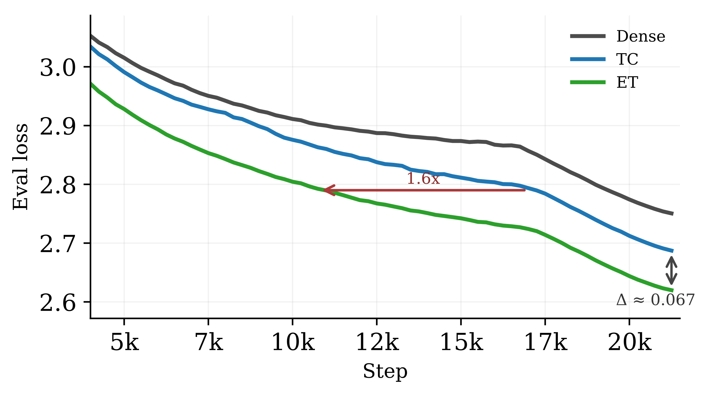
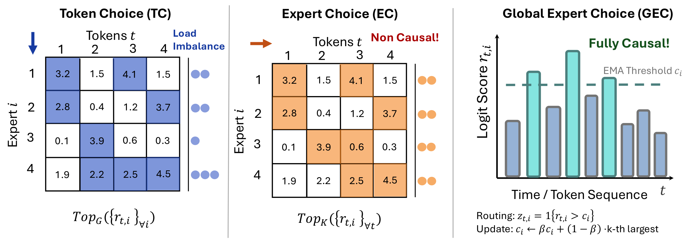
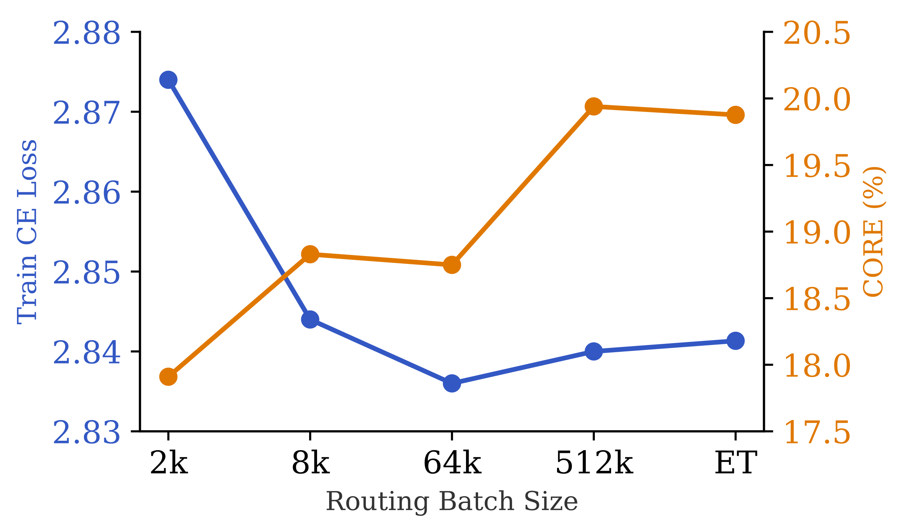
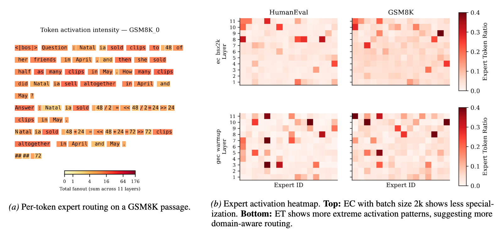
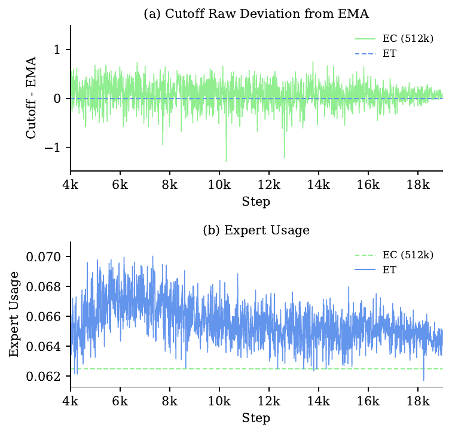

# Expert Threshold Routing

**Dynamic Computation and Load Balancing for Autoregressive Language Models**

Ryan Sun, Yixin Liu, Yonghui Wu, and Lichao Sun

[Paper](https://arxiv.org/abs/2603.11535) · [Hugging Face](#)

<p align="center">
  
</p>

In pretraining experiments scaling to 2.4B parameters on FineWeb-Edu, Expert Threshold (ET) routing achieves 0.067 lower cross-entropy loss than Token Choice, equivalent to reaching the same performance with 1.6× fewer tokens.

## The Problem

Mixture of Experts face a routing dilemma. Token Choice (TC) routing lets each token pick its top experts, but this creates load imbalance and requires auxiliary losses to prevent collapse. Expert Choice (EC) routing flips the direction, letting experts pick their top tokens, which gives perfect load balance and allows tokens to receive variable computation. But EC breaks causality because selecting the top tokens requires seeing the entire batch, including future positions.



## Our Approach

We observe that load balance only needs to hold in expectation over the data distribution, not exactly within each batch. Expert Threshold (ET) routing maintains an exponential moving average of each expert's selection threshold, estimated from historical batches. At both training and inference, a token activates an expert whenever its score exceeds that threshold. This simple change makes routing fully causal while preserving EC's benefits.

## Autoregressive Generation for Expert Choice

Expert Choice improves as the routing batch size grows. Larger pools stabilize the selection threshold, reducing noise in routing decisions. This supports the view that routing should come from global score distributions rather than local batch rankings.

<p align="center">
  
</p>

ET takes this to the limit by tracking each expert's threshold via EMA, approximating what EC would do over an infinitely large batch. Because ET uses the same threshold at training and inference, there is no train-inference mismatch, enabling fully causal autoregressive generation.

## Dynamic Computation and Expert Specialization

Unlike Token Choice, which activates a fixed number of experts per token, ET allows variable computation. Some tokens activate zero routed experts while important tokens activate multiple. The model learns to allocate more compute to sentence boundaries, numerical results, and structurally important positions. This flexibility also leads to sharper expert specialization, with experts developing clear preferences for code or math tokens.

<p align="center">
  
</p>

## Near Perfect Load Balancing

EC and ET achieve load balance through complementary mechanisms. EC fixes expert usage by selecting exactly top-k tokens per batch, but this means the cutoff threshold varies batch to batch. ET inverts the tradeoff by fixing the threshold via EMA, accepting small variance in per-batch expert usage while keeping routing decisions stable.

<p align="center">
  
</p>

## What Is Included

- Training entrypoint: `train.py`
- Core model/runtime code: `src/`
- Hydra configs: `configs/`
- Minimal scripts: `script/train.sh`, `script/run_configs.sh`, `script/download_data.sh`, `script/train_tokenizer.sh`
- CORE evaluation: `eval_core.py` and `src/eval/core.py`
- Wandb logging support

This release intentionally excludes benchmark suites, visualization modules, agent/memory files, and archived/reference repos.

## Requirements

- Python 3.10+
- CUDA-capable PyTorch environment
- `NANOCHAT_BASE_DIR` environment variable set

Example:

```bash
export NANOCHAT_BASE_DIR=/data2/.cache/nanochat
pip install -r requirements.txt
```

## Data And Tokenizer (Integrated, No External nanochat Repo)

Download parquet shards:

```bash
./script/download_data.sh -1 8
```

Train tokenizer from local parquet data:

```bash
./script/train_tokenizer.sh 65536 2000000000
```

Both scripts use in-repo modules (`src.data.nanochat_dataset`, `src.data.train_tokenizer`).

## Train

Quick single-process EC run:

```bash
MODEL_SIZE=tiny TRAINING_TOKENS=1 N_GPUS=1 ./script/train.sh --mlp ec --g 2 --e 8
```

Threshold-oriented ET run with implied EC warmup:

```bash
MODEL_SIZE=tiny TRAINING_TOKENS=10 N_GPUS=1 ./script/train.sh --mlp et --g 2 --e 8
```

Run catalog (multiple experiments):

```bash
./script/run_configs.sh
```

You can also call Hydra directly:

```bash
python train.py model_size=tiny mlp=ec
python train.py model_size=tiny mlp=et
```

## CORE Eval

```bash
python eval_core.py eval.core_checkpoint_path=/path/to/checkpoint.pt
```

## Engine Design

Two expert engines are kept intentionally:

- `ExpertEngine` (`src/models/engines/engine.py`): default routed-expert path
- `ParallelExperts` (`src/models/engines/parallel_experts_manual.py`): expert-parallel path

Wrappers select by `model.expert_parallel`.

## Provenance Notes

- Training/data/tokenizer flow is adapted from nanochat-style recipes and integrated directly into this repo.
- Token-choice kernels/operators are sourced from vendored ScatterMoE code under `scattermoe/`.
- File-level provenance comments are included in runtime modules.

## Citation

If you find this work useful, please cite

```bibtex
@article{sun2026expertthresholdrouting,
  title={Expert Threshold Routing for Autoregressive Language Modeling with Dynamic Computation Allocation and Load Balancing},
  author={Sun, Ryan and Liu, Yixin and Wu, Yonghui and Sun, Lichao},
  journal={arXiv preprint arXiv:2603.11535},
  year={2026},
  url={https://arxiv.org/abs/2603.11535}
}
```
