# December 12, 2025: Experiment Report

I have finally implemented EP, which allows me to run below experiments.

## Experiment Runs: 

**Experiment 1: GEC_shared with EP (run_gec_shared_ep.sh)**
- EP 8x the batch size --> 128k tokens
- Topk routing (default)

**Experiment 2: GEC_shared with EP + Capacity Constraints (run_gec_shared_ep_capacity.sh)**
- Capacity Constraints 12.5%

**Experiment 3: GEC_shared with EP + Capacity Constraints + slower ema decay (run_gec_shared_ep_capacity.sh)**
- Capacity Constraints 12.5%
- Slower ema decay 0.99 --> 0.999

Sadly, I did not see a clear improvement from pure topk routing. 

## Obersavtions

### Obersavtions on Cutoff EMA

The behavior of cutoff EMA can be grouped into two categories: L0 and later layers.

#### L0 layer

The cutoff EMA of L0 layer moves like crazy: 
 - Unlike other layers' cutoff which goes 0 --> ~-4.0 --> gradually -1.5, it goes up to ~18.0, stays there for a while, and sometimes drop down to 10, then go back up to 18.0.

**Graphs (L0 routing)**

*Cutoff EMA (L0, E0)*  
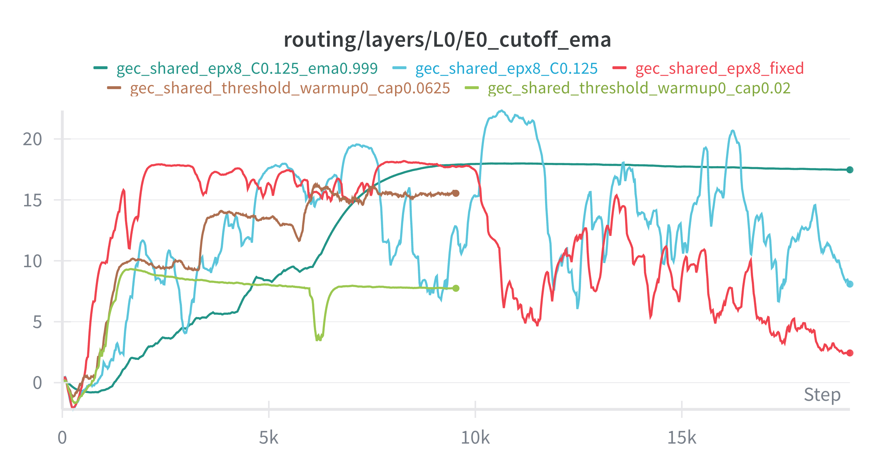

*Cutoff (L0, E0)*  
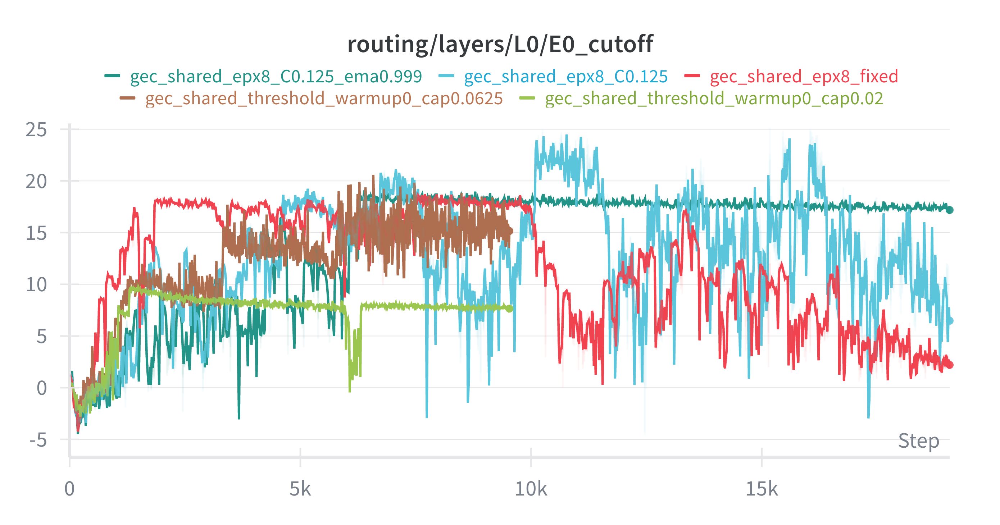

**Analysis**: L0 E0 is weird. The cutoff EMA rises to ~15-18 (vs. negative values in later layers). The oscillation may indicate some issue and cause issue with capacity constraints and load balancing.

**Interplay with slow ema decay**
With slower ema decay, the discrepancy between the cutoff EMA and the cutoff becomes larger in L0, espeically at moments where we oscillations that cutoff drop down from 18 to 10, causing raw expert usage (the activated tokens assuming capacity is not in effect) to skyrocket to 100%. 

*Raw expert usage (L0, E0)*
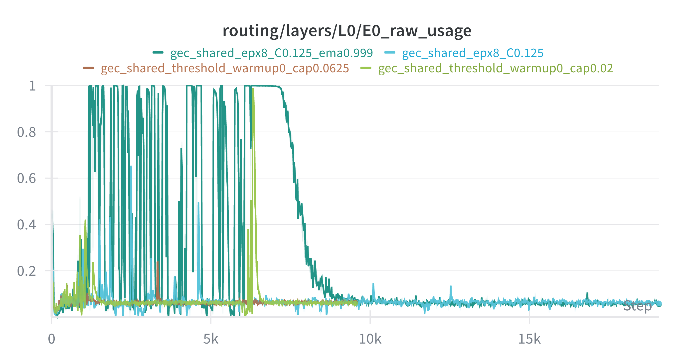

Meanwhile, the overflow rate (the percentage of upper capacity bound being hit) is larger (~0.4 vs 0.25 of 0.99 ema decay). This could be due to L0's oscillations causing overflow.

#### Oscillating cutoff EMA

The rest of the layers show a different pattern. There update is indeed stable, however, with ema decay 0.99, the cutoff EMA shows small periodic oscillation.

**Graphs (L4, E0)**

*Cutoff EMA (L4, E0)*  
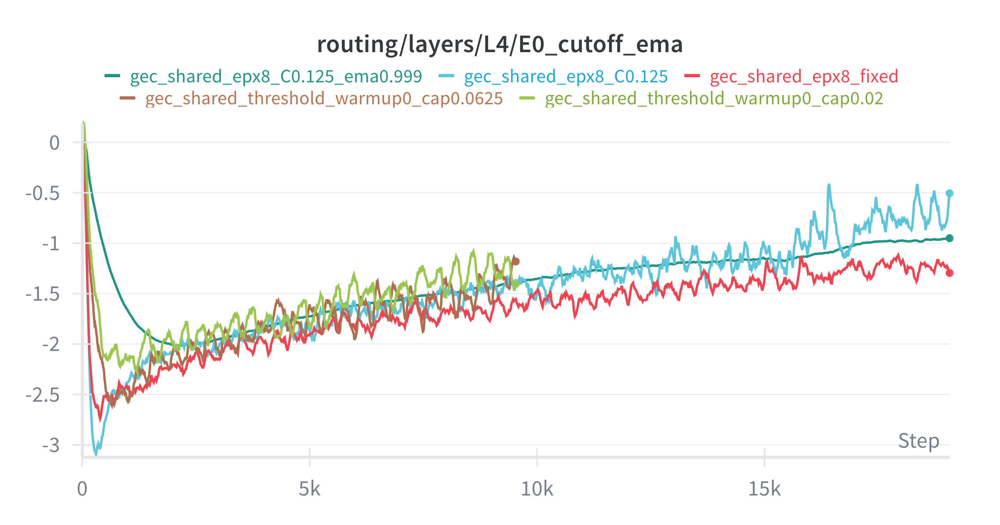

*Cutoff EMA (L6, E0)*  
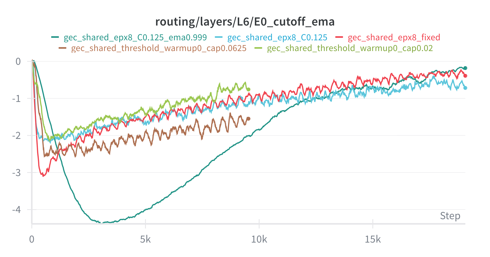

**Analysis**: L4 and L6 E0 show a small periodic oscillation in the cutoff EMA with topk and 0.99 ema decay. This oscillation is smaller than L0's, but still noticeable.

> **Discussion Box: Do Oscillating Cutoff EMAs Matter?**  
>  
> • Is the oscillation in cutoff EMA (in L0 and in higher layers) simply a reflection of natural batch-to-batch routing variance, or does it indicate router instability or sub-optimal learning?  
>  
> • Could these oscillations exacerbate capacity constraint overflows or poor expert utilization, especially in L0?
>
> • Some dynamics causing oscillations? (e.g. gradient? Normalization?)

**Solutions**
- Much larger decay rate (0.999)
- Eliminated oscillations, but caused issue with L0

### GradNorm and Initialization

**Issue**

I noticed that, while nanochat uses zero initialization for the output projections (e.g., `lm_head.weight` and `c_proj.weight`), our code uses small initialization ($\sim 1/\sqrt{fan\_in}$) for the expert weights (e.g., `expert_weight2` and `shared_weight2`). This is different from nanochat.

This may cause the initial bump in grad norm.

*GradNorm*
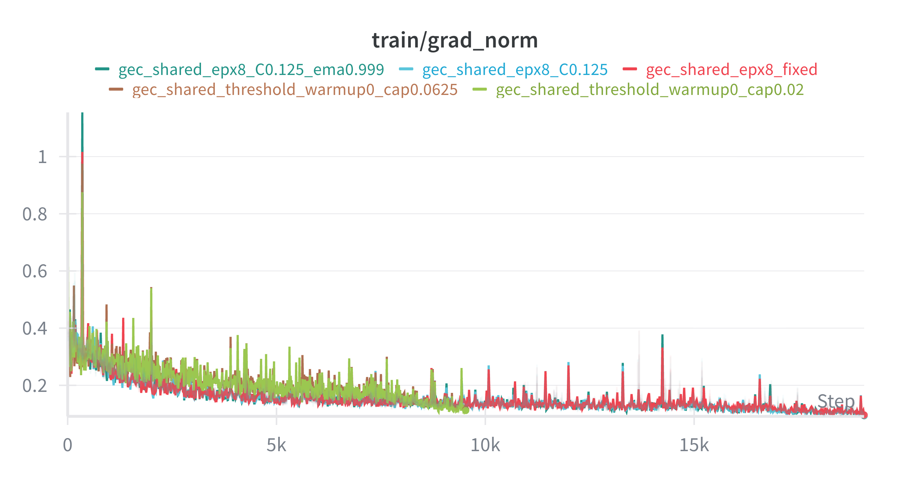

> **Discussion Box: Is Initialization Important?**
>  
> • Is the difference in scale of gradient also causing issues in the weird behavior of L0?
> 
> • Does it affect the routing behavior of models?

**Side Effect** 

To maintain scale invariance, we scale the expert output by the number of experts activated for the token. 
- Can it be related to the oscillations?

Now, to test this, we have to have correct zero initialization first, because otherwise the gradient norm will be too large.

## Future Experiment Designs:

<b>Hypothesis 1: Zero Initialization is Important [IMPLEMENTED]</b>

**Experiment 4: GEC_shared with EP + Topk Routing + Zero Initialization (run_gec_shared_ep.sh)**
- Zero initialization for the expert weights (e.g., `expert_weight2` and `shared_weight2`) ✅ Implemented 2025-12-13
- 0.99 ema decay (default)
- Script: `script/run_gec_shared_ep.sh` → WandB: `gec_shared_epx8_zeroinit`

Expected Result:
- Grad Norm is smaller (since the initialization is smaller)
- Better loss
- Maybe no issue with L0?

<b>Hypothesis 2: First Layer is problematic and should use dense</b>

**Experiment 5: GEC_shared with EP + Topk Routing + Dense for L0**
- Dense for L0

Expected Result:
- Better loss
- No issue with L0

**Experiment 5.1: GEC_shared with EP + Capacity Constraints + Dense for L0**
- Dense for L0
- Capacity Constraints
- 0.999 ema decay

Expected Result:
- Overflow rate is smaller
- No fluctuations in overall behavior
- Very stable routing for rest of the layers

We do these first.

### Other potential experiments

Besides those, we might want to try:
- Remove normalization
- Remove underflow capacity constraints (i.e. it's okay to have too few tokens selected)

# December 13, 2025: Experiment Report

**Experiment 4: GEC_shared with EP + Topk Routing + Zero Initialization (run_gec_shared_ep.sh)**
- Zero initialization for the expert weights (e.g., `expert_weight2` and `shared_weight2`) ✅ Implemented 2025-12-13
- 0.99 ema decay (default)
- Script: `script/run_gec_shared_ep.sh` → WandB: `gec_shared_epx8_zeroinit`

Results: 
- Grad Norm is still big
- Loss is much better
- No effect on L0

Interesting, so only loss improved. Still, this is enough for us to adjust all future experiments to use zero initialization.

Now run 

**Experiment 4.1: GEC_shared with EP + Capacity Constraints 0.125 + Zero Initialization + 0.99**
- Capacity Constraints 0.125
- Zero Initialization
- 0.99 ema decay
- Script: `script/run_gec_shared_ep_capacity.sh` → WandB: `gec_shared_epx8_C0.125_zeroinit_ema0.99`

Results:
- Grad Norm is same
- Loss is much better
- No effect on L0
- Loss lower than experiment 4, **CONSISTENTLY**! **NICE!**

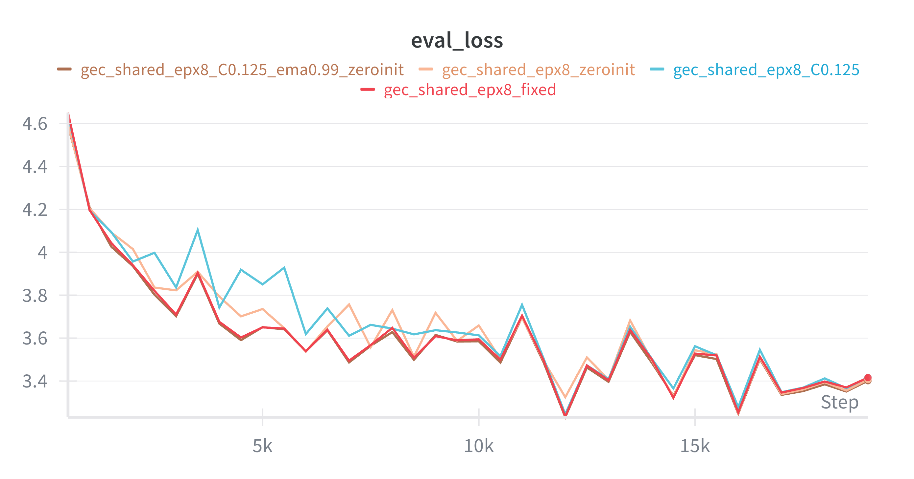

I suddenly noticed that the overflow and underflow rates start dropping at the same time learning rate decay starts:

*Learning Rate Schedule*
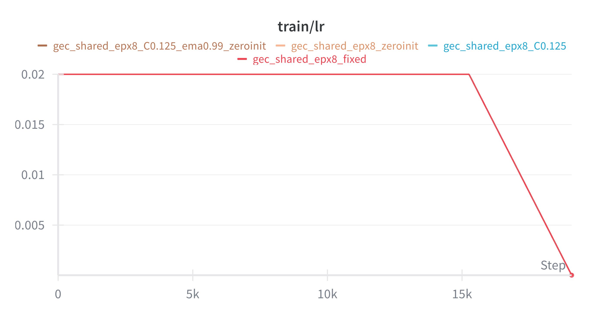

*Capacity Overflow Rate*
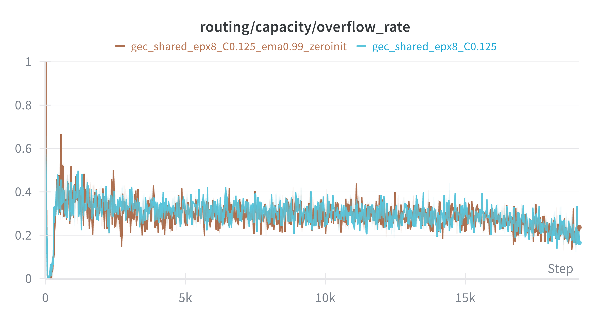

*Capacity Underflow Rate*
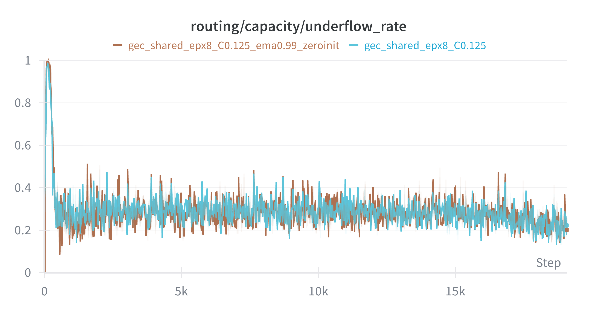

**Analysis**: Both overflow and underflow rates hover around 0.3-0.4 during the constant LR phase (steps 0-15k), then drop to ~0.2 once LR decay begins at step 15k. This suggests that as the model converges (smaller gradients, more stable representations), the router becomes more calibrated and hits capacity bounds less frequently. The EMA cutoffs better track the actual routing distribution when the model stops changing rapidly.

> **Discussion Box: LR Decay and Routing Stability**
>
> • Does the correlation imply that capacity constraints are mainly active during the "exploration" phase of training?
>
> • Could we use a warmup period for capacity constraints (disabled early, enabled later) to allow more routing flexibility initially?
>
> • Is the ~0.2-0.3 overflow/underflow rate at convergence acceptable, or should we tune the capacity bound (currently 12.5%)?

**Experiment 4.2: GEC_shared with EP + Capacity Constraints 0.125 + Zero Initialization + 0.999 ema decay**
We might just give up on this one, and start 5.0 and 5.1 instead.

---

**Experiment 5.0: GEC_shared with EP + Topk Routing + Zero Initialization + 0.999 ema decay + Dense for L0**
- Topk Routing
- Zero Initialization
- 0.999 ema decay
- Dense for L0
- Script: `script/run_gec_shared_ep.sh` → WandB: `gec_shared_epx8_topk_zeroinit_ema0.999_fld`

Expected Results:
- Better loss (than 4.0)
- More stable routing and training
- Smaller test eval discrepancy

**Experiment 5.1: GEC_shared with EP + Capacity Constraints 0.125 + Zero Initialization + 0.999 ema decay + Dense for L0**
- Capacity Constraints 0.125
- Zero Initialization
- 0.999 ema decay
- Dense for L0
- Script: `script/run_gec_shared_ep_capacity.sh` → WandB: `gec_shared_epx8_C0.125_zeroinit_ema0.999_fld`

Expected Results:
- Better loss (than 5.0 and 4.1)
- Lower overflow and underflow rates
- More stable routing and training
- Smaller test eval discrepancy

# December 17, 2025: Experiment Report

## Experiment Results

**Experiment 5.0: GEC_shared with EP + Topk Routing + Zero Initialization + 0.99 EMA + Dense for L0**
- Topk Routing
- Zero Initialization
- 0.99 ema decay (default)
- Dense for L0
- WandB: `gec_shared_epx8_topk_fld`

**Experiment 5.1: GEC_shared with EP + Capacity 0.125 + Zero Initialization + 0.993 EMA + Dense for L0**
- Capacity Constraints 0.125
- Zero Initialization
- 0.993 ema decay
- Dense for L0
- WandB: `gec_shared_epx8_C0.125_ema0.993_fld`

**Experiment 5.2: GEC_shared with EP + Capacity 0.125 + Zero Initialization + 0.999 EMA + Dense for L0**
- Capacity Constraints 0.125
- Zero Initialization
- 0.999 ema decay
- Dense for L0
- WandB: `gec_shared_epx8_C0.125_ema0.999_fld`

Results at step 19000:
- 5.0 (topk_fld): 3.40737
- 5.1 (C0.125_ema0.993_fld): 3.40714
- 5.2 (C0.125_ema0.999_fld): **3.40456** (best)

*Eval Loss (5.0, 5.1, 5.2 comparison)*
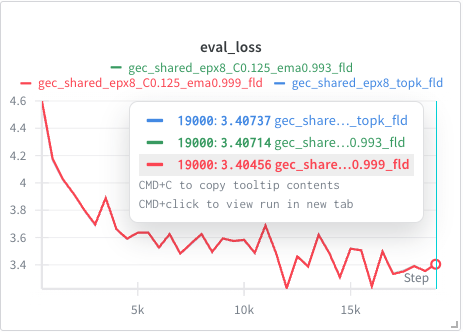

*Eval Loss (topk_fld vs zeroinit baseline)*
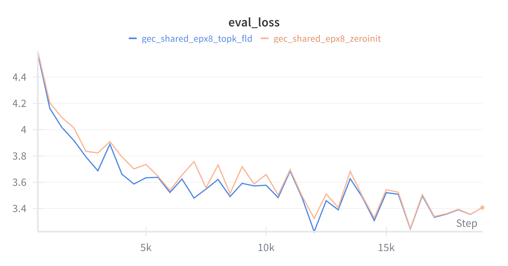

*Capacity Overflow Rate (0.993 vs 0.999 ema)*
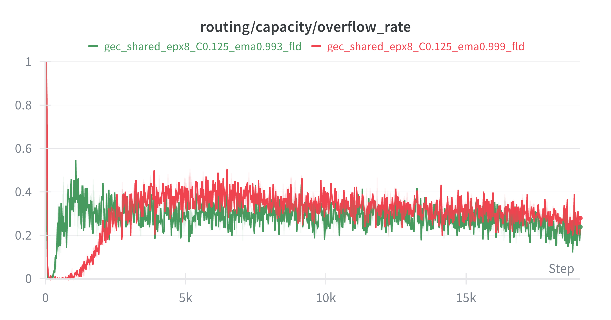

*Capacity Underflow Rate (0.993 vs 0.999 ema)*
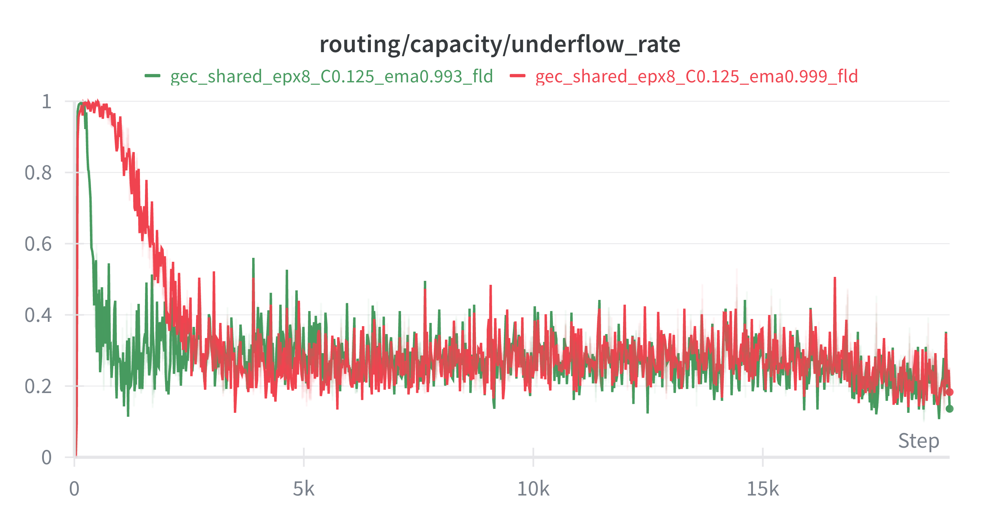

## Observations

### Observation 1: First Layer Dense Makes Routing Easier

Using a dense MLP for the first layer (L0) instead of sparse MoE significantly stabilizes routing behavior.

**Prior Art:**
- **DeepSeek-MoE** uses dense layers for the first few layers before transitioning to MoE
- **Kimi** also employs first-layer-dense as standard practice

**Analysis**: First-layer-dense is becoming a convention in MoE architectures, likely because:
1. Early layers learn general token representations that don't benefit from specialization
2. Routing decisions are harder when input representations are not yet stable
3. Removes the problematic L0 oscillation behavior we observed

### Observation 2: Cutoff EMA Stability vs Responsiveness Trade-off

**Problem:** Cutoff EMA oscillates/shakes with default decay (0.99), causing unstable routing.

**Current Solution:** Longer EMA decay (0.999)
- More stable cutoffs, eliminates small periodic oscillations
- However, causes delay in tracking actual routing distribution
- Larger discrepancy between cutoff EMA and actual cutoff during distribution shifts

**Analysis**: The 0.999 EMA is better for stability, but the delay may cause issues during rapid distribution shifts (e.g., L0 oscillations before we used first-layer-dense).

> **Discussion Box: EMA Alternatives**
>
> We might use other smoothing methods to balance stability and responsiveness:
>
> • **Holt's Linear Trend Method** (Double Exponential Smoothing): Tracks both level and trend, better at following systematic changes while smoothing noise
>
> • **Double EMA**: Applies EMA twice to reduce lag while maintaining smoothness
>
> • **Adaptive EMA**: Adjust decay rate based on recent variance (higher variance → faster decay)
>
> • Which method best captures the "true" routing threshold while filtering batch noise?
